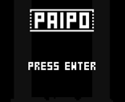

# paipo

*Made with Godot 3.2.3*

I made this game for LOWREZJAM, it was almost complete but I didn't have time to compose or find good music... Maybe I'll polish it a little bit later.

It's one of these pipe puzzles where you have to arrange the pipes in a way so that water reaches the other end before time runs out. There's no progression, each round is just randomly generated pipes on a 8x7 grid.

## Controls

- Arrows: controls the cursor
- Space: changes pipe orientation
- F: Fill the pipes
- R: Reset round

